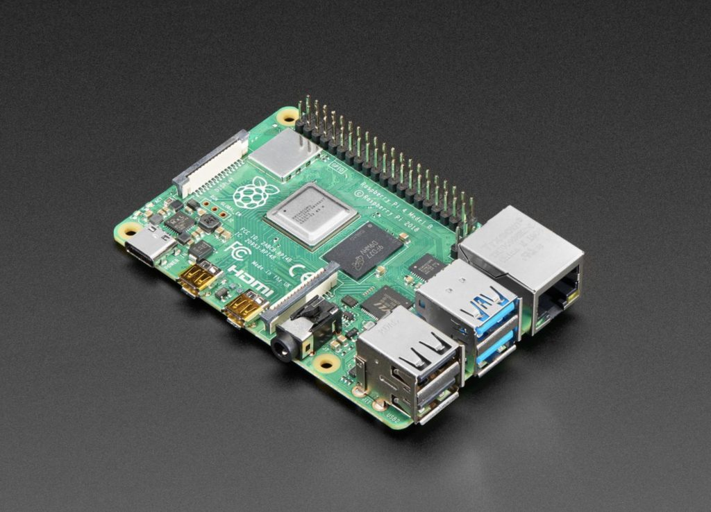

+++
title = "My Pi Setup: What's Installed?"
description = "Raspberry Pi: Block ads, control devices, bridge connections easily!"
summary = "Raspberry Pi: Block ads, control devices, bridge connections easily!"
date = 2023-11-12
lastmod = 2023-11-13
showDateUpdated = "true"
type = "post"
draft = "false"
categories = ["raspberrypi"]
tags = ["tech"]
images = ["https://kom.al/blog/20231113-raspberrypi/thumb.jpg"]
+++

Ever since I got my Raspberry Pi 4 Model B with 4GB of RAM in January 2020, it's been a reliable helper at home. It can do more than you might think, so let me share how I've made it useful for privacy, automation, and entertainment without getting too techy.

## Blocking Annoying Ads and Trackers with AdGuard Home
I installed AdGuard Home on my Raspberry Pi to stop those annoying ads and trackers from bothering my devices on the home Wi-Fi. It's like a bouncer for your internet. If you want to set it up, just follow the steps in this guide: [AdGuard Home Guide](https://pimylifeup.com/raspberry-pi-adguard-home/). And, for extra blocking power, check out the filter list at [oisd.nl](https://oisd.nl/).

## Making Non-HomeKit Devices Play Nice with HomeBridge
My Philips Wiz lights ([Bulb](https://amzn.eu/d/g5PahRL) & [Batten](https://amzn.eu/d/3323rph)) weren't playing nice with my Apple stuff, but I found a workaround. I used something called HomeBridge on the Raspberry Pi, which basically acts like a translator between non-HomeKit devices and Apple devices. You can set it up with the help of this guide: [HomeBridge Guide](https://pimylifeup.com/raspberry-pi-homebridge/).

## Creating Your Personal Entertainment Hub with Plex
Turned my Raspberry Pi into a mini Netflix at home using [Plex](https://plex.tv) Media Server. Now, I can watch my favorite shows, movies, and listen to music on any device at home. You can set it up too by following this guide: [Plex Media Server Guide](https://pimylifeup.com/raspberry-pi-plex-server/).

## Turning LED Strips On and Off with the Raspberry Pi
My [LED strips](https://amzn.eu/d/fOHDthp) didn't come with a remote, so I got creative. I connected them to the USB port of the Raspberry Pi and easily managed them by remotely switching the power to the USB ports on and off using SSH commands. These commands are sent using the Shortcut App on my Apple devices to run scripts over SSH, hence allowing me to remotely control the LED strips. It's not as complicated as it sounds..

#### SSH command to turn it on:
echo password | sudo -S uhubctl -l 2 -a 1
#### SSH command to turn it off:
echo password | sudo -S uhubctl -l 2 -a 0

## Using Raspberry Pi as a Bridge Between Mobile and Router
In the past, there were no wired internet connections in my area. So, I came up with a solution using the Raspberry Pi. I connected my mobile and the router through the Pi, bringing internet access everywhere at home. If you want to know more about how I did it, check out this solution on [Stack Overflow](https://stackoverflow.com/q/41766414).

## Conclusion
So, there you have it. Your Raspberry Pi can do a lot for you at home, and it doesn't take a tech genius to set these things up. Give it a try and make the most of your little helper! If you have any specific questions or need more details about these projects, don't hesitate to reach out. I'm here to help, so feel free to ask anything!